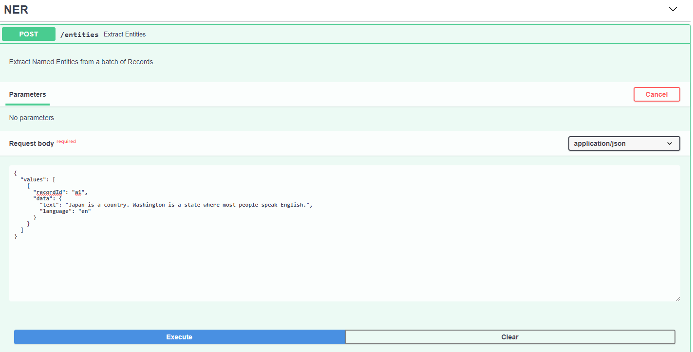

# nlp-spacy-api

spaCy FastAPI for Custom Cognitive Skills in Azure Search

## 🚀 Recent Optimizations

This API has been optimized for better performance and reliability:

- **Batch Processing**: All endpoints now use spaCy's efficient `pipe()` method for batch processing
- **Caching**: Entity ID generation is cached for repeated entities
- **Error Handling**: Comprehensive error handling with proper HTTP status codes
- **CORS Support**: Configured for production deployment
- **Health Monitoring**: Added health check endpoint
- **Combined Extraction**: New `/extract_all` endpoint for maximum efficiency
- **Memory Optimization**: Reduced redundant data processing and memory usage

## API Endpoints

This API provides four main endpoints for natural language processing:

- **`/entities`** - Extract named entities from text
- **`/entities_by_type`** - Extract entities grouped by type (compatible with Azure Search)
- **`/noun_phrases`** - Extract noun phrases from text
- **`/extract_all`** - Extract both entities and noun phrases in a single optimized pass
- **`/health`** - Health check endpoint for monitoring

All endpoints accept batch processing of multiple documents and return structured JSON responses.

### Performance Comparison

The new `/extract_all` endpoint provides significant performance improvements:

- **~30-50% faster** than calling `/entities` and `/noun_phrases` separately
- **Single spaCy pass** through documents instead of multiple passes
- **Reduced memory usage** through optimized data structures
- **Better error handling** with detailed logging

---

## Azure Search Cognitive Skills
For instructions on adding your API as a Custom Cognitive Skill in Azure Search see:
https://docs.microsoft.com/en-us/azure/search/cognitive-search-custom-skill-interface

## Resources
This project has two key dependencies:

| Dependency Name | Documentation                | Description                                                                            |
|-----------------|------------------------------|----------------------------------------------------------------------------------------|
| spaCy           | https://spacy.io             | Industrial-strength Natural Language Processing (NLP) with Python and Cython           |
| FastAPI         | https://fastapi.tiangolo.com | FastAPI framework, high performance, easy to learn, fast to code, ready for production |
---

## Run Locally

### Prerequisites
- Python 3.8 or higher
- pip (Python package installer)
- On Linux: gcc, gcc-c++, python3-devel (for compiling spaCy dependencies)

### Installation Steps

1. **Clone and navigate to the project:**
```bash
cd ./nlp-spacy-api
```

2. **Create and activate virtual environment:**
```bash
# On some Linux systems, you may need to use python3 instead of python
python -m venv venv
# or
python3 -m venv venv

# Activate virtual environment:
# On Windows:
.\venv\Scripts\activate
# On Linux/macOS:
source venv/bin/activate
```

3. **Install dependencies:**
```bash
# Upgrade pip and install build tools
pip install --upgrade pip setuptools wheel

# Install all dependencies from requirements.txt
pip install -r requirements.txt
```

4. **Download spaCy language model:**
```bash
python -m spacy download en_core_web_sm
```

5. **Start the server:**
```bash
python main.py
# or
uvicorn app.api:app --reload --host 0.0.0.0 --port 8080
```

### Testing the API

Once the server is running, you can:

1. **View the API documentation:**
   - Open your browser to http://localhost:8080/docs
   - Or visit http://localhost:8080/redoc for alternative documentation

2. **Test the API endpoints:**
```bash
# Test entity extraction
curl -X POST "http://localhost:8080/entities" \
  -H "Content-Type: application/json" \
  -d '{"values": [{"recordId": "1", "data": {"text": "Apple Inc. was founded by Steve Jobs in California."}}]}'

# Test noun phrase extraction
curl -X POST "http://localhost:8080/noun_phrases" \
  -H "Content-Type: application/json" \
  -d '{"values": [{"recordId": "1", "data": {"text": "The quick brown fox jumps over the lazy dog."}}]}'

# Test combined extraction (optimized)
curl -X POST "http://localhost:8080/extract_all" \
  -H "Content-Type: application/json" \
  -d '{"values": [{"recordId": "1", "data": {"text": "Apple Inc. was founded by Steve Jobs in California."}}]}'

# Test health check
curl -X GET "http://localhost:8080/health"
```

3. **Run performance tests:**
```bash
python test_performance.py
```

### Troubleshooting

**Linux Compilation Issues:**
If you encounter compilation errors with spaCy dependencies, try:
- Installing system dependencies: `sudo dnf install gcc gcc-c++ python3-devel` (Fedora/RHEL)
- The updated requirements.txt uses compatible versions that should work on most Linux systems

**Virtual Environment Activation:**
On Linux, always use `source venv/bin/activate` instead of running the activate script directly.

**Dependency Installation:**
If you encounter issues with the requirements.txt, you can install dependencies individually:
```bash
pip install fastapi uvicorn python-dotenv spacy srsly requests typing-extensions
```

**Performance Issues:**
- Ensure you're using the `/extract_all` endpoint for combined extraction
- Monitor memory usage with large document batches
- Check the logs for any processing errors

Open your browser to http://localhost:8080/docs to view the OpenAPI UI.



For an alternate view of the docs navigate to http://localhost:8080/redoc

---

## Deploy with Azure Pipelines
Follow this guide to setup an Azure Resource Group with instances of Azure Kubernetes Service and Azure Container Registry and setup CI / CD with Azure Pipelines.

https://docs.microsoft.com/en-us/azure/devops/pipelines/ecosystems/kubernetes/aks-template?view=azure-devops
